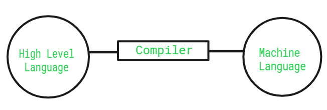

# What is a compiler?

1. A compiler is a translating program that translates the instructions of a high-level language to machine-level language.
2. Source program is given as input to the compiler, which later converts it to a machine-level language. After conversion, the program is known as the Object code.

Reference [GFG](https://www.geeksforgeeks.org/compiler-design/introduction-to-compilers/)

