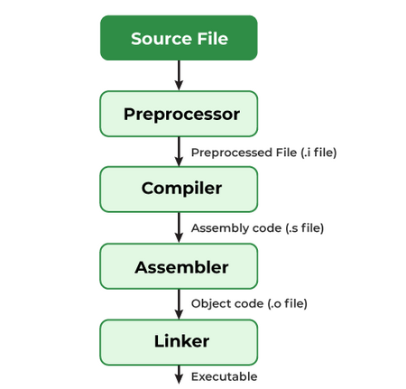

# What is the process of compilation?

1. Compilation is the translation of source code (the code we write) into object code (a sequence of statements in machine language) by a compiler.
2. The process has four steps
   1. pre-processing
   2. compiling
   3. assembling
   4. linking
3. Pre-processor:
   1. It gets rid of all the comments in the source file(s)
   2. It includes the code of the header file(s), which is a file with the extension .h that contains C function declarations and macro definitions
   3. It replaces all of the macros (fragments of code which have been given a name) with their values
   4. The output of this step will be stored in a file with a “.i” extension, so here it will be in main.i
   5. To stop the compilation right after this step, we can use the option “-E” with the gcc command on the source file, and press enter.
   6. Command: `gcc -E main.c`
4. Compiler:
   1. The compiler will take the preprocessed file and generate IR code (Intermediate Representation), so this will produce a “.s” file.
   2. Compiling phase in C uses an inbuilt compiler software to convert the intermediate (.i) file into an Assembly file (.s) having assembly-level instructions (low-level code).
   3. We can stop after this step with the “-S” option on the gcc command, and press enter.
   4. Command: `gcc -S main.c`
   5. The whole program code is parsed (syntax analysis) by the compiler software in one go, and it tells us about any syntax errors or warnings present in the source code through the terminal window.
5. Assembler:
   1. Assembler is a pre-written program that translates an assembly file into machine code.
   2. It takes basic instructions from an assembly code file and converts them into binary/hexadecimal code specific to the machine type, known as the object code.
   3. The file generated has the same name as the assembly file and is known as an object file with an extension of .obj in DOS and .o in UNIX OS.
   4. Command: `gcc -c main.c`
6. Linking:
   1. Linking is a process of including the library files in our program.
   2. Library Files are some predefined files that contain the definition of the functions in the machine language, and these files have an extension of .lib
   3. The linking process generates an executable file with an extension of .exe in DOS and .out in UNIX OS.
   4. We can also choose to create an executable program with the name we want, by adding the “-o” option to the gcc command, placed after the name of the file or files we are compiling
   5. Command: `gcc main.c -o my_program`

Reference [GFG](https://www.geeksforgeeks.org/c/compiling-a-c-program-behind-the-scenes/) [Scaler](https://www.scaler.com/topics/c/compilation-process-in-c/) [Medium](https://medium.com/@laura.derohan/compiling-c-files-with-gcc-step-by-step-8e78318052)