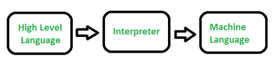

# What is an interpreter? Difference between compiler and interpreter.

1. The interpreter converts high-level language to an intermediate language. It contains pre-compiled code, source code, etc.
2. The simple role of an interpreter is to translate the material into a target language. An Interpreter works line by line on the code.
3. It translates only one statement of the program at a time.
4. Interpreters, more often than not, are smaller than compilers.

# Difference between compiler and interpreter

| Aspect            | Compiler                                                                                                                                        | Interpreter                                                                                                                                    |   |   |
|-------------------|-------------------------------------------------------------------------------------------------------------------------------------------------|------------------------------------------------------------------------------------------------------------------------------------------------|---|---|
| Translation       | Translates the entire source code into machine code (object code) before execution.                                                             | Translates and executes the source code line-by-line or statement-by-statement during execution.                                               |   |   |
| Output            | Generates a standalone executable file (e.g., .exe in Windows) that can run independently.                                                      | Does not produce a separate executable file; requires the source code and the interpreter every time the program runs.                         |   |   |
| Speed (Execution) | Generally, compiled programs run much faster because the code is already in machine format.                                                     | Execution is slower because translation occurs in real-time during program run.                                                                |   |   |
| Error Detection   | Reports all errors after scanning the entire program (or file), so the program cannot run until all errors are fixed.                           | Stops execution at the first error it encounters, making debugging easier and more interactive.                                                |   |   |
| Memory            | Requires more memory during the compilation phase to create the object code, but less during execution as the compiler is not needed in memory. | Requires less memory initially as it doesn't generate intermediate object code, but the interpreter itself resides in memory during execution. |   |   |
| Portability       | The generated machine code is platform-specific and requires recompilation for different operating systems or architectures.                    | The same source code can run on any platform that has a compatible interpreter, making it more portable.                                       |   |   |
| Use Case          | Best suited for large, performance-critical applications like operating systems and game engines.                                               | Ideal for scripting, rapid prototyping, and development environments where immediate feedback is valuable.                                     |   |   |

Reference [GFG](https://www.geeksforgeeks.org/compiler-design/difference-between-compiler-and-interpreter/)