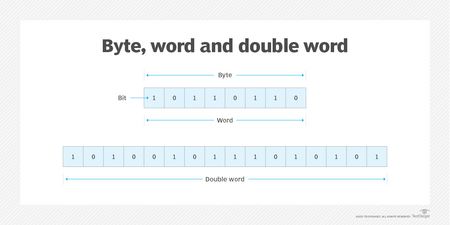

# What does the word refer to from a programming point of view?

1.  In computing architecture, a word is a fixed unit of data containing a specific number of bits that can be addressed and moved between storage and the computer processor.
2.  The defined bit length of a word is equivalent to the width of the computer's data bus, so that a word can be moved in a single operation from storage to a processor register.
3.  For any computer with an 8-bit architecture, every 8 bits equals 1 byte, and any multiples of that 8-bit byte make up a word -- i.e., the word size is some multiple of 8 bits.
4.  Examples
    1.  In Intel's PC processor architecture, a word is 16 bits, or two contiguous 8-bit bytes.
    2.  For IBM's Z family of mainframe computers, a word is 64 bits, or eight contiguous 8-bit bytes.

# Advantages

1.  Processors and embedded systems with word sizes up to 64 bits, or 8 bytes, can support advanced instruction sets and faster system clock and bus speeds.
2.  The longer the architected word length, the more the computer system processor can do in a single operation.

# Function of a word

1. A computer word can contain various data types and data structures. It might contain a computer instruction, a storage address, certain application data that is manipulated, or even processing-related data and instructions, such as digital signal processing.

# How word length affects computer processor performance?

1. The word length that a computer can process is another way to express the amount of data that the processor can handle simultaneously. More data can be transferred to the processor in a single pass if the word length that the processor can handle on a single pass is longer. This increases processor performance.

Reference [Techtarget](https://www.techtarget.com/whatis/definition/word)