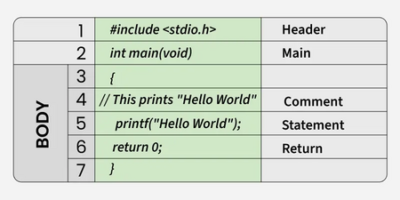

# What is the basic structure of a C program?

1. The very first component of the C program is the header file. It is an .h file that contains C function declarations and macro definitions to be shared among several source files.
2. The next part of a C program is the main() function. It is a user-defined function where the execution of a program starts. Every C program must contain, and its return value typically indicates the success or failure of the program.
3. A pair of curly brackets defines the body of a main function, and it is the entry point of a C program. The execution typically begins with the first line of the main().
4. There are comments as well in the body of the function that are used for the documentation of the code or to add notes in your program.
5. The last part of any C function is the return statement. The return statement refers to the return values from a function. This return statement and return value depend upon the return type of the function. The value 0 typically means successful termination.

