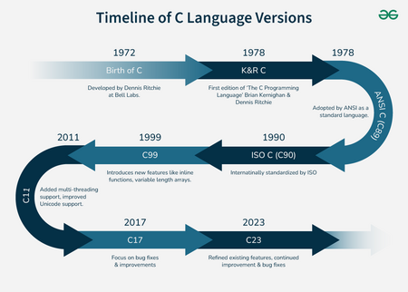

# How C programming language evolved over the period of time?

1. In 1972, Dennis Ritchie developed the C programming language at Bell Laboratories of AT&T Labs.
2. In 1978, Dennis Ritchie and Brian Kernighan published The C Programming Language book, now referred to as the "K&R" book.
3. In 1983, the American National Standards Institute (ANSI) committee completed a final draft standard known as ANSI C (C89).
4. In 1990, the International Organization for Standardization (ISO) approved ANSI C as (C90).
5. In 1999, (C99) was introduced with a variety of constructs, including: inline functions, variable-length arrays, complex numbers, and other improvements to floating-point operations. C99 also introduced the long long data type and the nature of single-line comments (//).
6. In 2011, (C11) was introduced with many new features and addressed safety and concurrency. The most notable are Generic type programming, threading support (threads.h), and Unicode.
7. In 2017, The (C17/C18) standard was released which is a minor revision of C11. The standard also fixed bugs of C11.
8. In 2023, (C23) was released, which added features such as nullptr, binary literals, and more advanced support for modern hardware architecture.

